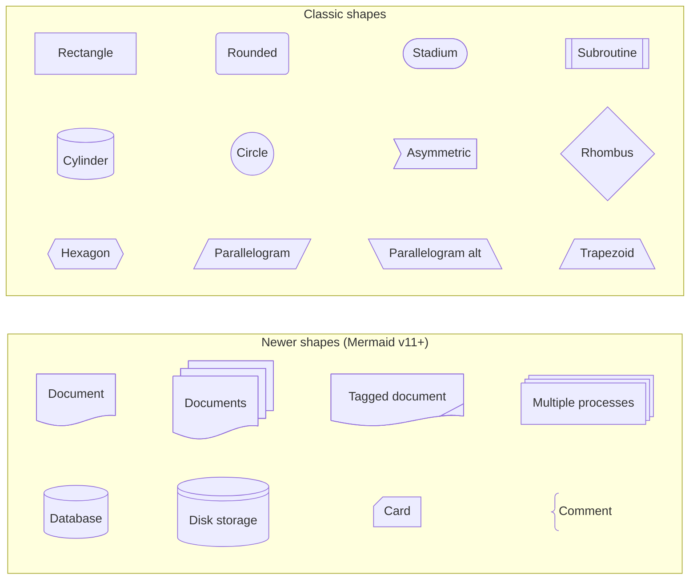

```mermaid
flowchart TB
    subgraph Classic["Classic shapes"]
        direction LR
        A1["Rectangle"] ~~~ A2("Rounded") ~~~ A3(["Stadium"]) ~~~ A4[["Subroutine"]]
        B1[("Cylinder")] ~~~ B2(("Circle")) ~~~ B3>"Asymmetric"] ~~~ B4{"Rhombus"}
        C1{{"Hexagon"}} ~~~ C2[/"Parallelogram"/] ~~~ C3[\"Parallelogram alt"\] ~~~ C4[/"Trapezoid"\]
    end

    subgraph Newer["Newer shapes (Mermaid v11+)"]
        direction LR
        D1@{ shape: doc, label: "Document" } ~~~ D2@{ shape: docs, label: "Documents" } ~~~ D3@{ shape: tag-doc, label: "Tagged document" } ~~~ D4@{ shape: processes, label: "Multiple processes" }
        E1@{ shape: cyl, label: "Database" } ~~~ E2@{ shape: lin-cyl, label: "Disk storage" } ~~~ E3@{ shape: notch-rect, label: "Card" } ~~~ E4@{ shape: brace, label: "Comment" }
    end

    Classic ~~~ Newer
```
